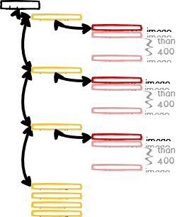
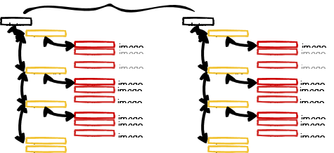
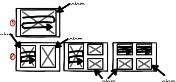

## Welcome to RxJS Notes

This page aims to share my knowlege about rxjs technics. 

### Technic1: 
1. Each item in the array is used as a part of the url to get the first result through asynchronous communication.
2. The result of the first async communication is used in the url to get the second result from the remote server.
3. Get the image url with the second result.

[Detail diagram](/technic1.md)

### Technic2:
1. Nested object with 3 layers, parent has children (nested objects) and child has grandchildren (nested objects).
2. There are many parents, 
3. A grandchild node has an image address.
4. Finally, image addresses need to be saved as a file, which has all the relation from parent to child. 

[Detail diagram](/technic2.md)

### Technic3:
1. The user can select the grid type randomly: one, two, three, or four grids.
2. If grid type1 is selected, then the html element id is element1, which can be a canvas area for drawing.
3. If grid type2 is selected, then the html elements are element1 and element2. Each element is passed on to the next process sequentially.
4. If grid type2 is selected, the process of element2 has to wait until the rendering process for element1 is complete.
5. Each split window has multiple images, which are obtained from the server through asynchronous communication.
6. Each split window displays only one image and others are cached.
7. When multi grid type is selected, while the previous split window starts to cache after displaying the first image, the next split window starts the rendering process.

[Detail Diagram](/technic3.md)

### High quality RxJS articles

1. [RxJS Cached](https://blog.thoughtram.io/angular/2018/03/05/advanced-caching-with-rxjs.html )
2. [Creating Custom Operators](https://netbasal.com/creating-custom-operators-in-rxjs-32f052d69457)
3. [Partition, shareReplay, concatMapTo](https://netbasal.com/use-rxjs-to-modify-app-behavior-based-on-page-visibility-ce499c522be4)
4. [Reactive Sticky Header in Angular](https://netbasal.com/reactive-sticky-header-in-angular-12dbffb3f1d3)
5. [Reactive Search Feature with Angular](https://medium.com/lapis/searching-through-a-list-reactively-in-angular-c61c9d1832df)
6. [Observableinput](https://medium.com/javascript-everyday/rxjs-observableinput-dbc9c7035adc)
7. [15 Technics](https://sentinelone-tech.medium.com/15-rxjs-awesome-tips-from-15-sentinels-84ad132b13fd)
8. [3 Ways To Handle Errors in RxJS](https://medium.com/javascript-in-plain-english/3-ways-to-handle-errors-in-rxjs-97a04f2ecdc)
9. [Multicast](https://netbasal.com/understanding-rxjs-multicast-operators-77b3f60af0a2)
10. [Defer](https://netbasal.com/getting-to-know-the-defer-observable-in-rxjs-a16f092d8c09)

