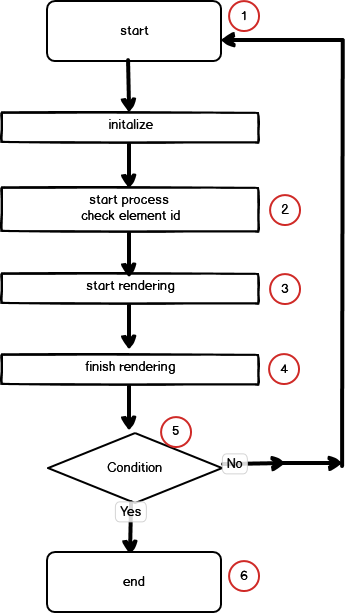

### Condition
1. User can select randomly, one grid, two or three or four.
2. One grid, then html element id is element1, which can be a canvas area for drawing.
3. Two grids, then html elements are element1 element2, each elements is inputed to next process sequencially.
4. If two grids slected, process of element2 have to wait until element1 is completing process.
5. Each sprit window has multiple images, which is got from server by async communication.
6. Each sprit window display one page of ct-image and others are cached or in the middle of caching process. 
7. Just the time the previous split window start to cache, next split window start to rendering.


For each split window has it's own element id like as ( element1, element2, element3, element4)
following snippet replace it as selectedElementId

- case 1: One split window,
	When get the grid size, start to image rendering.
- case 2: Multi split window. (2 or 3 or 4)
	1. When get the grid size, start to rendering from the first split window.
	 2. The next split window wait until the previous split window completing rendering.

---


Using zip operator (rxjs) to wait the next process complete.
case1: One split window.
1. Just after taking grid type, start rendering. 

case2: Multi split window.
1. isStartedRendering: status of after initial setting for starting rendering.
2. isFinishedRendering: status of complete rendering and related side job. 
3. above step 1. and step 2. job is completed.
4. When user select grid type, create this observable for wating above step 3. 
5. After step3 and step4 is completing, it means one of split window processing is completed.
---



---
```ts
    private renderingSplitWindows() {
        /**
         * When it comes to rendering of split-windows,
         * each window need to wait until the previous window finished rendering.
         * -----------------
         * 1. The end of redering process of the first image, emit event of "isStartedRendering$" for each split window.
         * 2. As soon as take the event of "isStartedRendering$" start processing some functions
         * 3. After end of processing some functionsmaking series-list, nodule-list, emit event of "isFinishedRendering$"
         *    for each split window.
         * */
        const isFinished$ = this.currentCtViewerElementId$.pipe(     // 1
            switchMap(val => {
                this.selectedElementId = val.selectedElementId;     // 2
                return this.ctService.isFinishedRendering$[this.selectedElementId]
                    .pipe(take(1)); 				// 3
            }),
            takeUntil(this.unsubscribe$)
        );

        const isStarted$ = this.currentCtViewerElementId$.pipe(      // 4
            switchMap(val => {
                this.selectedElementId = val.selectedElementId;
                return this.ctService.isStartedRendering$[this.selectedElementId]
                    .pipe(take(1));
            }),
            takeUntil(this.unsubscribe$)
        );
        // 
        if ( gridNo > 1 ) {
            if (this.selectedElementId === '#dicomImage') {         // 5
                this.tempObservable = defer(() => of(EMPTY).pipe());
            } else if (this.selectedElementId === '#dicomImage01') {
                this.tempObservable = zip(isFinished$, isStarted$).pipe(  
                    filter(val => val[1] === '#dicomImage'),        // 6
                );
            } else if (this.selectedElementId === '#dicomImage02') {
                this.tempObservable = zip(isFinished$, isStarted$).pipe(
                    filter(val => val[1] === '#dicomImage01'),
                );
            } else if (this.selectedElementId === '#dicomImage03') {
                this.tempObservable = zip(isFinished$, isStarted$).pipe(
                    filter(val => val[1] === '#dicomImage02'),
                );
            }
        } else { // only one split window
            this.tempObservable = defer(() => of(EMPTY).pipe());    // 7
        }
    }

```

```ts
    private initializeNgInit() {
        const rendering$: Observable<any> = this.requestSplitWindow$[this.selectedElementId];
                                                                    // 8
        zip(this.tempObservable, rendering$).pipe(   // 9
            take(1),
            tap((val) => {
                const data = {selectedElementId: val[1]};
                /** Forward this to Webviewer-vertical.component.
                 * Where this value is used to call function "getNodules" */
                this.store.dispatch(new SetSelectedElementId(data));
            })
        ).subscribe((val) => {
            /** Start processing ct-viewer after finished processing for previous split window*/
            this.renderingCtViewerSplitWindow(val[1]);              // 10
        });
  }
```
showSelectedSeriesToViewer
	this.store.dispatch(new SetSelectedCtViewer(data)) --> currentCtViewerElementId$
	
1. currentCtViewerElementId$, when process arrive at the proper position of checking then make observable
2. then reserve element id as selectedElementId, which can tell which split window is processing. 
3. and wait process reach the final state.
4. Same as above step 1,2,3 except waiting the process reach the start state.
5. make observable for each element, which can be used parameter of zip operator (rxjs), 
6. Each split window has it's own element like as ( element1, element2, element3, element4 )
7. From the first split window, make the observale for element1 like renderingSplitWind['element1'];
8. This observable is used for waiting the end of the first split window complete rendering.  
