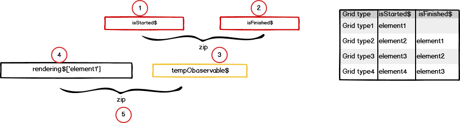

```ts
    private renderingSplitWindows() {
        /**
         * When it comes to rendering of split-windows,
         * each window need to wait until the previous window finished rendering.
         * The signal of finished is come from the v-toolbox.
         * -----------------
         * 1. The end of processing of ct-image, emit event of "isStartedRendering$" for each split window.
         * 2. As soon as take the event of "isStartedRendering$" start processing nodule-list,
         *    which can make series-list, nodule-list.
         * 3. After end of making series-list, nodule-list, emit event of "isFinishedRendering$"
         *    for each split window.
         * */
        const elementId$ = this.currentCtViewerElementId$.pipe( // To know the end of processing of series-list, nodule-list
            filter(val => val.selectedElementId !== undefined),
            switchMap(val => {
                this.selectedElementId = val.selectedElementId;
                return this.ctViewerService.isFinishedRendering$[this.selectedElementId].pipe(take(1));
            }),
            takeUntil(this.unsubscribe$)
        );

        const ctViewer$ = this.currentCtViewerElementId$.pipe( // To know the end of ct-viewer processing
            filter(val => val.selectedElementId !== undefined),
            switchMap(val => {
                this.selectedElementId = val.selectedElementId;
                // console.log('-- wsjung -----ctViewer----------- currentElementId$', this.selectedElementId);
                return this.ctViewerService.isStartedRendering$[this.selectedElementId].pipe(take(1));
            }),
            takeUntil(this.unsubscribe$)
        );
        const {grids, gridMode} = this.ctViewerService.getGridMode(this.gridId);
        if ( gridMode > 1 ) {
            if (this.selectedElementId === '#dicomImage') { // first split window
                this.tempObservable = defer(() => of(EMPTY).pipe());
            } else if (this.selectedElementId === '#dicomImage01') {
                this.tempObservable = zip(ctViewer$, elementId$).pipe(
                    filter(val => val[1] === '#dicomImage'),
                );
            } else if (this.selectedElementId === '#dicomImage02') {
                this.tempObservable = zip(ctViewer$, elementId$).pipe(
                    filter(val => val[1] === '#dicomImage01'),
                );
            } else if (this.selectedElementId === '#dicomImage03') {
                this.tempObservable = zip(ctViewer$, elementId$).pipe(
                    filter(val => val[1] === '#dicomImage02'),
                );
            }
        } else {
            this.tempObservable = defer(() => of(EMPTY).pipe());
        }
    }

```

```ts
    private initializeNgInit() {
        const rendering$: Observable<any> = this.requestRenderingSplitWindow$[this.selectedElementId];
        let isInitialLoading$: Observable<boolean>;
        if (ElectronWrapper.isElectronApp()) {
            // vertical component의 onsessionInfo에서 isInitialLoading 값을 true로 세팅해줄때까지 기다림
            isInitialLoading$ = this.isInitialLoading$.pipe(
                takeUntil(this.unsubscribe$),
                filter(val => val)
            );
        } else {
            isInitialLoading$ = this.isInitialLoading$.pipe(take(1),mapTo(true));
        }

        zip(this.tempObservable, rendering$, isInitialLoading$).pipe(
            // takeUntil(this.unsubscribe$)
            take(1),
            tap((val) => {
                const data = {selectedElementId: val[1]};
                /** Forward this to Webviewer-vertical.component.
                 * Where this value is used to call function "getNodules" */
                this.store.dispatch(new SetSelectedElementId(data));
            })
        ).subscribe((val) => {
            /** Start processing ct-viewer after finished processing for previous split window*/
            this.renderingCtViewerSplitWindow(val[1]);
        });
  }
```
