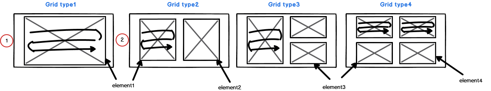

- case 1: grid no is one split window,
	When get the grid size, start to image rendering.
- case 2: grid no is multi split window.
	1. When get the grid size, start to rendering from the first split window.
	 2. The next split window wait until the previous split window completing rendering.


```ts
    private renderingSplitWindows() {
        /**
         * When it comes to rendering of split-windows,
         * each window need to wait until the previous window finished rendering.
         * -----------------
         * 1. The end of redering process of the first image, emit event of "isStartedRendering$" for each split window.
         * 2. As soon as take the event of "isStartedRendering$" start processing some functions
         * 3. After end of processing some functionsmaking series-list, nodule-list, emit event of "isFinishedRendering$"
         *    for each split window.
         * */
        const elementId$ = this.currentCtViewerElementId$.pipe(     // 1
            filter(val => val.selectedElementId !== undefined),     // 2
            switchMap(val => {
                this.selectedElementId = val.selectedElementId;     // 3
                return this.ctService.isFinishedRendering$[this.selectedElementId]
                    .pipe(take(1)); // 4
            }),
            takeUntil(this.unsubscribe$)
        );

        const ctViewer$ = this.currentCtViewerElementId$.pipe(      // 4
            filter(val => val.selectedElementId !== undefined),     
            switchMap(val => {
                this.selectedElementId = val.selectedElementId;
                return this.ctService.isStartedRendering$[this.selectedElementId]
                    .pipe(take(1));
            }),
            takeUntil(this.unsubscribe$)
        );
        // 
        if ( gridNo > 1 ) {
            if (this.selectedElementId === '#dicomImage') {         // 5
                this.tempObservable = defer(() => of(EMPTY).pipe());
            } else if (this.selectedElementId === '#dicomImage01') {
                this.tempObservable = zip(ctViewer$, elementId$).pipe(  
                    filter(val => val[1] === '#dicomImage'),        // 6
                );
            } else if (this.selectedElementId === '#dicomImage02') {
                this.tempObservable = zip(ctViewer$, elementId$).pipe(
                    filter(val => val[1] === '#dicomImage01'),
                );
            } else if (this.selectedElementId === '#dicomImage03') {
                this.tempObservable = zip(ctViewer$, elementId$).pipe(
                    filter(val => val[1] === '#dicomImage02'),
                );
            }
        } else { // only one split window
            this.tempObservable = defer(() => of(EMPTY).pipe());    // 7
        }
    }

```

```ts
    private initializeNgInit() {
        const rendering$: Observable<any> = this.requestSplitWindow$[this.selectedElementId];
                                                                    // 8
        zip(this.tempObservable, rendering$, isInitialLoading$).pipe(   // 9
            take(1),
            tap((val) => {
                const data = {selectedElementId: val[1]};
                /** Forward this to Webviewer-vertical.component.
                 * Where this value is used to call function "getNodules" */
                this.store.dispatch(new SetSelectedElementId(data));
            })
        ).subscribe((val) => {
            /** Start processing ct-viewer after finished processing for previous split window*/
            this.renderingCtViewerSplitWindow(val[1]);              // 10
        });
  }
```
